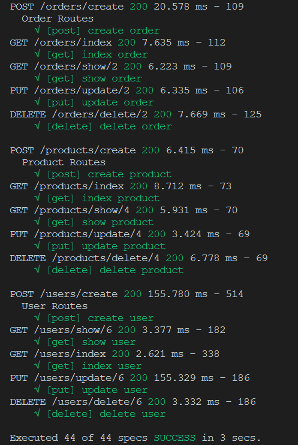

# Udacity: Build A Storefront Backend

    backend API build in Nodejs express for an online store.

## REQUIREMENTS

- and API route information can be found in the [REQUIREMENT.md](REQUIREMENTS.md)

## ports

### `http://localhost:3000/`

    THE SERVER in in port 3000
    database in port 5432

## Set Up Database

- add your database information in the `.env` file as `.ex.env`

      DB_HOST=`localhost`
      DB_PORT=`5432`
      DB_NAME=`DatabaseName`
      DB_NAME_TEST=`DatabaseNameTest`
      DB_USER=`UserName`
      DB_PASSWORD=`Password`

- `npm run db:up` (create database)

- `npm run db:down` (reset database)

## Set Up Project

- `npm i` install all dependencies and development dependencies
- `npm run dev` (start the server on port 3000)
- `npm run build` (to build to es5 and start the server on port 3000)

## Testing

- `npm run test` (to run the tests)
- `npm run test:down` (to clean the test database)

## database ERD

## database schema

