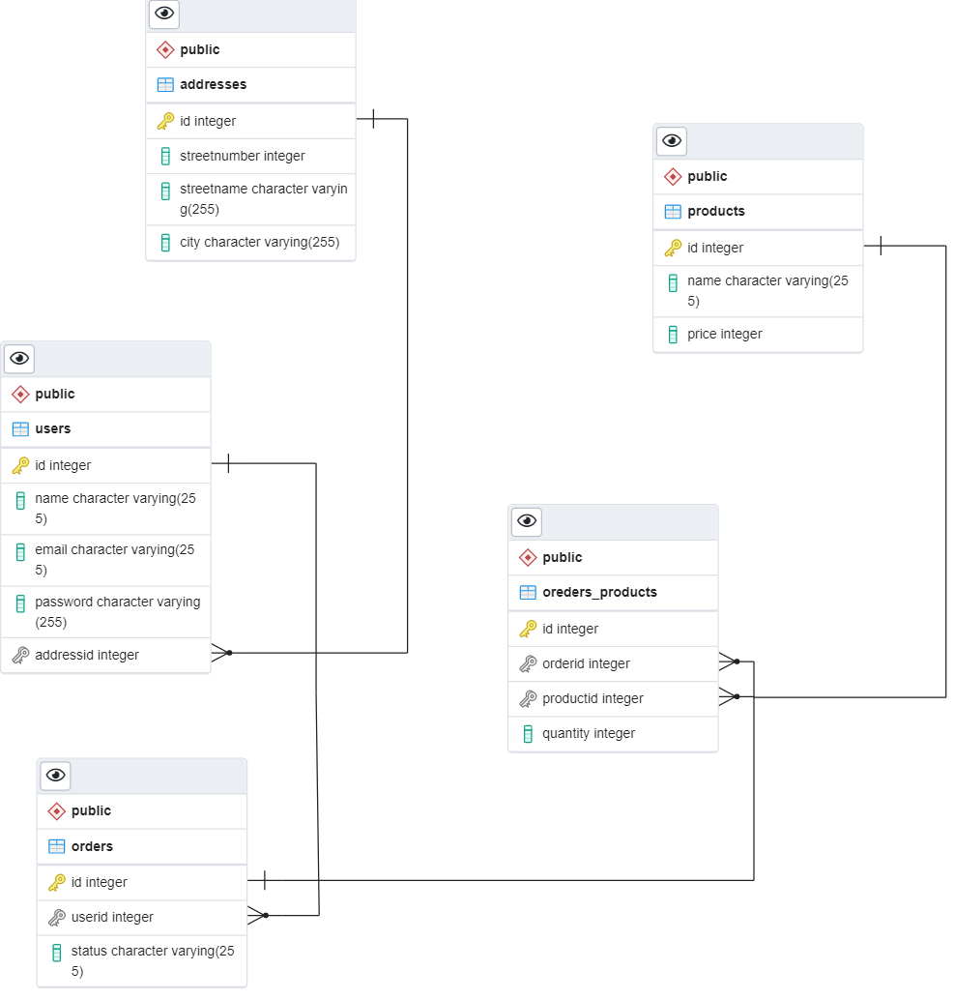

# Udacity: Build A Storefront Backend

    backend API build in Nodejs express for an online store.

## database ERD

## database schema

and API route information can be found in the [REQUIREMENT.md](REQUIREMENTS.md)

## Set up

- `npm i`
- add your database information in the .env file
- `npm run db:up` (make sure you have the correct database information)
- `npm run dev` (start the server on port 3000)
- `npm run build` (to build to es5 and start the server on port 3000)
- `npm run test` (to run the tests)

## Testing
